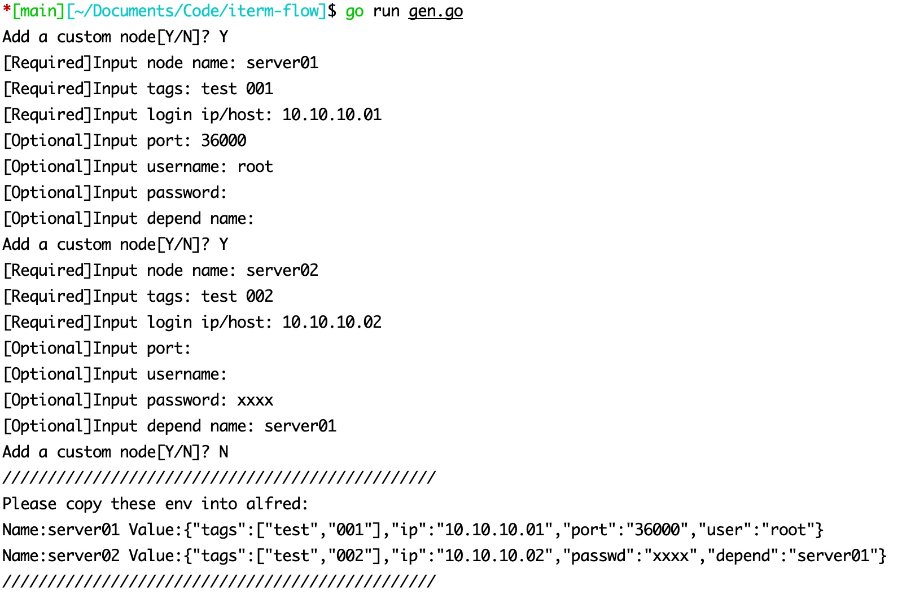
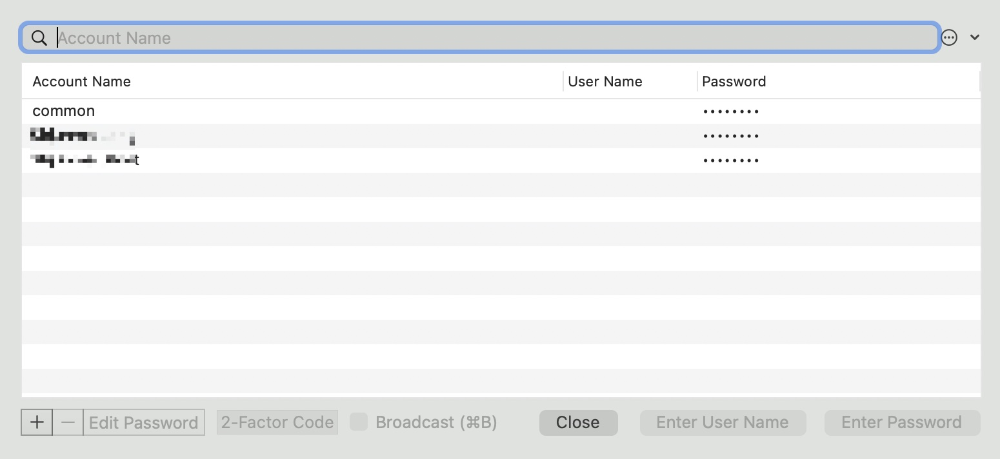

# iterm-flow
Alfred workflow for auto login in iterm2

## Introduce
Common login case is easy, you can send `ssh root@ip` and input `passwd`. Also you can use `ssh-keygen` to generate key for no password login.
According to above information, you can make simple workflow like [alfred-ssh](https://github.com/isometry/alfred-ssh), making login more smart.

[Alfred-ssh](https://github.com/isometry/alfred-ssh) which reading login information from hosts config has some disadvantages.
1. When machines number grow, we can't find dest machine info quickly.
2. In some cases, our login server routine is `localhost->jumper->dest_server`, so Alfred-ssh cannot work well.

What `iterm-flow` do is 
1. Providing  `gen.go` for generating alfred env through machine info input.
2. Providing efficient way for search machine info.
2. Providing quick login method with less artificial work.
## Installation
1. Download [latest version](https://github.com/o98k-ok/iterm-flow/releases) and install it.
2. Add Alfred workflow env variables.
    1. You can use [gen.go](https://github.com/o98k-ok/iterm-flow/blob/main/gen.go) to generate env
    
    2. Or you can generate env by yourself:<br>
        Adding  a server, you should add an env `Name` is server name, `Value` is json format, the field with `omitempty`  is optional.
        ```golang
       type Node struct {
       	Tags []string `json:"tags"`
       	IP     string `json:"ip"`
       	Port   string `json:"port,omitempty"`
       	User   string `json:"user,omitempty"`
       	Passwd string `json:"passwd,omitempty"`
       	Depend string `json:"depend,omitempty"`
       }
        ```
## Manual
1. Quickly login

2. About login passwd: <br>
    Passwd is very important, I recommend you don't generate passwd when generate json env. You can call the password manager of Iterm2 by `option+comman+f`.
    More you can do like [this](https://medium.com/@ratchada.jududom/how-to-ssh-iterm2-with-password-manager-576b0452b493)
    
## Features
1. Managing server login information [Add/Del/List]
2. Auto login with/without dependency node
4. Login with passwd or login without passwd
5. Auto set current iterm2 tab title as server name[env Name]
## Build
```
// run gen.go
# go run gen.go
// build list.go
# go build list.go
```
## Acknowledgement
1. I get much info from [vitorgalvao/custom-alfred-iterm-scripts](https://github.com/vitorgalvao/custom-alfred-iterm-scripts)